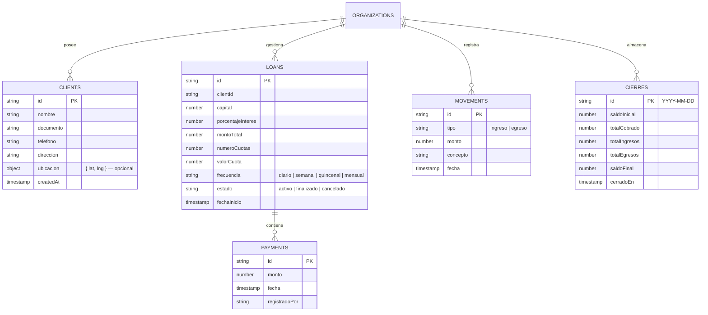

# CobraDiarioApp — Sistema Integral de Gestión de Créditos, Cobranza Diaria y Caja

**CobraDiarioApp** es una solución tecnológica progresiva (PWA) y multitenant diseñada para optimizar y automatizar la gestión de préstamos, la ruta de cobranza diaria, el cálculo de mora en tiempo real, el control de caja y la generación de cierres contables con exportación a PDF.

**Demo en producción:** [https://cobradiarioapp.netlify.app](https://cobradiarioapp.netlify.app)

Construido con **React 18**, **Vite**, **Tailwind CSS** y **Firebase Firestore**, con soporte completo para sincronización y almacenamiento offline.

---

## Tabla de Contenidos

1. [Visión General](#visión-general)
2. [Estructura del Proyecto](#estructura-del-proyecto)
3. [Instalación y Configuración](#instalación-y-configuración)
4. [Modelo de Datos en Firestore](#modelo-de-datos-en-firestore)
5. [Lógica de Negocio y Algoritmos Financieros](#lógica-de-negocio-y-algoritmos-financieros)
6. [Manual de Uso Operativo](#manual-de-uso-operativo)
7. [Funcionalidad GPS y Navegación](#funcionalidad-gps-y-navegación)
8. [Capacidades PWA y Modo Offline](#capacidades-pwa-y-modo-offline)
9. [Paleta de Colores y Sistema de Diseño](#paleta-de-colores-y-sistema-de-diseño)
10. [Despliegue en Producción](#despliegue-en-producción)
11. [Historial de Cambios](#historial-de-cambios)

---

## Visión General

CobraDiarioApp resuelve la necesidad de cobradores de campo y administradores de crédito de contar con una herramienta rápida, ligera y confiable, capaz de operar con buena conexión o en zonas rurales con señal deficiente.

### Funcionalidades principales

- **Priorización de Ruta ("Ruta del Día")**: Ordena automáticamente los clientes priorizando aquellos con cuotas vencidas o en mora, optimizando el tiempo del cobrador. Incluye botón de navegación GPS directo a Google Maps.
- **Clasificación Dinámica de Mora**: Algoritmo en tiempo real que clasifica la salud financiera del cliente (En Mora, Al Día, Adelantado) según la fecha oficial de Colombia (`America/Bogota`), omitiendo domingos y días no hábiles.
- **Captura y Navegación GPS**: El cobrador puede registrar las coordenadas GPS del domicilio del cliente desde el celular. Una vez guardadas, aparece el botón "Cómo llegar" que abre Google Maps con la ruta trazada.
- **Sincronización Offline**: Permite registrar cobros, préstamos y movimientos de caja sin conexión a internet. Los datos se sincronizan con Firestore al recuperar la red.
- **Control de Caja y Cierres Diarios**: Monitoreo de ingresos y egresos con cálculo de saldo neto diario e historial de cierres por fecha.
- **Generación de Reportes PDF**: Exportación de cierres diarios en formato PDF mediante `jsPDF` y `jspdf-autotable`.
- **PWA instalable**: Se instala directamente en Android, iOS o Windows como aplicación nativa desde el navegador.
- **Diseño Responsivo**: Interfaz optimizada para uso en campo (móvil) y en oficina (escritorio).

---

## Estructura del Proyecto

```text
CobraDiarioApp/
└── cobro-diario-app/
    ├── public/
    │   ├── favicon.ico
    │   ├── icon-192.png
    │   └── icon-512.png
    ├── firebase/
    │   └── firestore.rules
    ├── src/
    │   ├── components/
    │   │   ├── forms/
    │   │   │   ├── ClientForm.jsx          # Formulario de alta y edición de clientes
    │   │   │   └── LoanForm.jsx            # Formulario de créditos
    │   │   │                               # Prop onClientChange: notifica clientId al padre
    │   │   ├── layout/
    │   │   │   ├── BottomNav.jsx           # Barra de navegación inferior
    │   │   │   └── Header.jsx              # Cabecera con botón de retroceso
    │   │   └── ui/
    │   │       ├── Badge.jsx               # Etiqueta de estado (Mora / Al día / Adelantado)
    │   │       ├── ClientRow.jsx           # Fila de cliente con botón GPS opcional
    │   │       │                           # Prop ubicacion: muestra "Cómo llegar" si existe
    │   │       ├── FrequencySelector.jsx   # Selector de frecuencia de cobro
    │   │       └── MetricCard.jsx          # Tarjetas de métricas e indicadores
    │   ├── context/
    │   │   └── AuthContext.jsx             # Autenticación global y orgId
    │   ├── firebase/
    │   │   ├── auth.js                     # Inicio de sesión, registro y cierre
    │   │   ├── config.js                   # Inicialización con persistencia offline
    │   │   └── firestore.js                # API CRUD para Firestore
    │   ├── hooks/
    │   │   ├── useClients.js               # Suscripción en tiempo real + addClient + updateClient
    │   │   ├── useLoans.js                 # Suscripción en tiempo real para préstamos y pagos
    │   │   └── useMovements.js             # Suscripción en tiempo real para caja
    │   ├── logic/                          # Motor de negocio — no modificado en v1.1
    │   │   ├── caja.js                     # Arqueo y balance de caja
    │   │   ├── credito.js                  # Cálculo de interés, total y cuota
    │   │   ├── dateUtils.js                # Zona horaria Bogotá / Colombia
    │   │   ├── frecuencia.js               # Cuotas esperadas según días hábiles
    │   │   ├── mora.js                     # Clasificación de estado de mora
    │   │   └── pdfExport.js                # Generación de reportes PDF
    │   ├── pages/
    │   │   ├── Caja/                       # Registro de movimientos de efectivo
    │   │   ├── Clientes/                   # Directorio de clientes con botón GPS
    │   │   ├── Configuracion/              # Parámetros de la organización
    │   │   ├── Creditos/                   # Otorgamiento de créditos + captura GPS
    │   │   ├── Inicio/                     # Dashboard de métricas
    │   │   ├── Login/                      # Autenticación
    │   │   ├── RegistrarCobro/             # Cobro individual con botón "Cómo llegar" / "Guardar GPS"
    │   │   ├── Reportes/                   # Histórico de cierres y exportación PDF
    │   │   └── RutaDelDia/                 # Lista de cobranza diaria con GPS por cliente
    │   ├── styles/
    │   │   └── index.css
    │   ├── App.jsx                         # Enrutador principal (react-router-dom)
    │   └── main.jsx                        # Punto de entrada
    ├── .env
    ├── .env.example
    ├── .gitignore
    ├── index.html
    ├── netlify.toml
    ├── package.json
    ├── postcss.config.js
    ├── tailwind.config.js
    └── vite.config.js
```

---

## Instalación y Configuración

### Requisitos previos

- Node.js 18.0.0 o superior
- npm o yarn
- Proyecto en Firebase con Firestore y Authentication (Email/Contraseña) habilitados

### Pasos

**1. Clonar el repositorio:**
```bash
git clone <URL_DEL_REPOSITORIO> CobraDiarioApp
cd CobraDiarioApp/cobro-diario-app
```

**2. Instalar dependencias:**
```bash
npm install
```

**3. Configurar variables de entorno:**

Crear un archivo `.env` en la raíz de `cobro-diario-app/` a partir de `.env.example`:

```env
VITE_FIREBASE_API_KEY=tu_api_key
VITE_FIREBASE_AUTH_DOMAIN=tu_proyecto.firebaseapp.com
VITE_FIREBASE_PROJECT_ID=tu_proyecto_id
VITE_FIREBASE_STORAGE_BUCKET=tu_proyecto.appspot.com
VITE_FIREBASE_MESSAGING_SENDER_ID=tu_sender_id
VITE_FIREBASE_APP_ID=tu_app_id
```

**4. Ejecutar en modo desarrollo:**
```bash
npm run dev
```
La aplicación se abrirá en `http://localhost:5173`.

**5. Compilar para producción:**
```bash
npm run build
```
Los archivos optimizados se generarán en `dist/`.

---

## Modelo de Datos en Firestore

El sistema usa una arquitectura **multitenant aislada por organización**. Todos los datos residen bajo la ruta `/organizations/{orgId}/`, garantizando segregación completa entre usuarios.

### Colecciones principales



> El campo `ubicacion: { lat, lng }` se almacena en el documento del **cliente**, no del crédito, para que quede disponible en todos los créditos futuros sin duplicación. Es completamente opcional.

### Persistencia offline (`src/firebase/config.js`)

```javascript
import { initializeFirestore, persistentLocalCache, persistentMultipleTabManager } from 'firebase/firestore';

export const db = initializeFirestore(app, {
  localCache: persistentLocalCache({
    tabManager: persistentMultipleTabManager()
  })
});
```

---

## Lógica de Negocio y Algoritmos Financieros

Todos los cálculos residen en `src/logic/` y están completamente desacoplados de la interfaz. Esta capa no fue modificada en ninguna actualización posterior.

### Cálculo del crédito (`credito.js`)

Dado capital `C`, porcentaje de interés `I` y número de cuotas `N`:

```
Monto Interés       = C × (I / 100)
Monto Total a Pagar = C + Monto Interés
Valor por Cuota     = Monto Total / N
```

### Días hábiles y frecuencia (`frecuencia.js`)

Evalúa las fechas transcurridas desde el inicio del préstamo considerando la frecuencia de cobro y omitiendo domingos y días feriados configurados.

### Clasificación de mora (`mora.js`)

| Estado | Condición |
|---|---|
| `mora` | Total pagado < Total esperado a la fecha actual |
| `al_dia` | Total pagado = Total esperado a la fecha actual |
| `adelantado` | Total pagado > Total esperado a la fecha actual |

### Balance de caja (`caja.js`)

```
Saldo Neto = Saldo Inicial + Suma(Cobros) + Suma(Ingresos Extra) - Suma(Egresos)
```

---

## Manual de Uso Operativo

### Autenticación
Ingrese con correo y contraseña. En el primer registro, el sistema crea automáticamente una organización (`orgId`) con configuración predeterminada.

### Creación de clientes y créditos
1. Ir a **Clientes** → presionar **Nuevo Cliente** y completar el formulario.
2. Ir a **Creditos** → **Nuevo crédito**, seleccionar el cliente, ingresar capital, tasa, frecuencia y cuotas.
3. Opcional: presionar **"Capturar ubicación del cliente"** para registrar las coordenadas GPS del domicilio.

### Ruta del Día
Los clientes se listan ordenados: **En Mora** (rojo) primero, luego **Al Día** (dorado) y **Adelantado** (azul). Si el cliente tiene ubicación guardada, aparece el ícono de mapa en su fila para abrir la ruta en Google Maps.

### Registrar un cobro
1. Presionar sobre el cliente en la lista para ingresar a **Registrar Cobro**.
2. Si el cliente tiene ubicación: aparece el botón **"Cómo llegar"** que abre Google Maps.
3. Si el cliente no tiene ubicación: aparece el botón **"Guardar GPS"** para capturar la posición actual.
4. Ingresar el monto y confirmar el cobro. El saldo se actualiza en tiempo real.

### Caja y cierre diario
1. Registrar gastos o ingresos extra en el módulo de **Caja**.
2. Ir a **Reportes** para consultar el resumen del día.
3. Presionar **"Cerrar Caja del Día"** para consolidar el histórico en Firestore.
4. Presionar **"Descargar Reporte PDF"** para generar el comprobante.

---

## Funcionalidad GPS y Navegación

### Captura de ubicación

La funcionalidad es completamente **opcional y no bloqueante**. No interrumpe ningún flujo existente.

| Pantalla | Activación | Ícono |
|---|---|---|
| Nuevo Crédito | Botón debajo del formulario | `IconCurrentLocation` |
| Registrar Cobro | Botón "Guardar GPS" en la tarjeta del cliente | `IconMapPin` |

```javascript
// Las coordenadas se guardan en el documento del cliente:
updateClient(clientId, { ubicacion: { lat: latitude, lng: longitude } });
```

**Patrón de implementación correcto:** `NuevoCredito.jsx` usa estado React (`selectedClientId` via `useState`) que se actualiza a través de la prop `onClientChange` de `LoanForm`. No se accede al DOM directamente.

```javascript
// LoanForm.jsx — notifica al padre cuando cambia el selector de cliente
if (field === "clientId" && onClientChange) {
  onClientChange(value);
}

// NuevoCredito.jsx — usa estado React, no document.querySelector
const [selectedClientId, setSelectedClientId] = useState("");
<LoanForm onClientChange={setSelectedClientId} ... />
```

### Navegación

Cuando `client.ubicacion` existe, el botón "Cómo llegar" abre:

```
https://www.google.com/maps/dir/?api=1&destination={lat},{lng}
```

En Android abre Google Maps. En iOS abre Maps o Google Maps según la configuración del dispositivo.

**Disponible en:**
- Ruta del Día — ícono en cada fila de cliente
- Listado de Clientes — ícono en cada fila de cliente
- Registrar Cobro — botón prominente en la tarjeta del cliente

---

## Capacidades PWA y Modo Offline

- **Instalación**: Desde Chrome o Safari en móvil, la opción "Agregar a pantalla principal" instala la app de forma nativa.
- **Modo offline**: Sin señal, la aplicación sigue funcionando desde el Service Worker. Firebase almacena las operaciones en IndexedDB local y las sincroniza automáticamente con Firestore al recuperar la conexión.

---

## Paleta de Colores y Sistema de Diseño

Paleta pastel suave, optimizada para legibilidad en campo y bajo luz solar directa.

| Función | Hex | Clase Tailwind |
|:---|:---|:---|
| Color principal (brand) | `#5A52C5` | `bg-primary` / `text-primary` |
| Acento y botones | `#7F77DD` | `bg-primary-light` / `text-primary-light` |
| Fondo de pantalla | `#EEEDFE` | `bg-primary-bg` |
| Estado "Al Día" | amber | `bg-amber-50` / `text-amber-800` |
| Estado "En Mora" | red | `bg-red-50` / `text-red-600` |
| Estado "Adelantado" | blue | `bg-blue-50` / `text-blue-600` |

```javascript
// tailwind.config.js
theme: {
  extend: {
    colors: {
      primary:         "#5A52C5",
      "primary-light": "#7F77DD",
      "primary-bg":    "#EEEDFE",
      "surface-1":     "#F5F5F7",
      "surface-2":     "#EBEBF0",
    }
  }
}
```

### Principios de diseño aplicados

- Íconos semánticos diferenciados: `IconCurrentLocation` para capturar posición propia, `IconMapPin` para navegar hacia un destino.
- `e.stopPropagation()` en el botón GPS de `ClientRow` para evitar activar el click de la fila al presionar el ícono de mapa.
- Visualización de moneda con `Intl.NumberFormat` y atributo `translate="no"` para evitar que traductores automáticos conviertan el símbolo `$` a "dólares".
- Layout centrado con `max-w-5xl mx-auto` en escritorio; pantalla completa en móvil.

---

## Despliegue en Producción

**URL:** [https://cobradiarioapp.netlify.app](https://cobradiarioapp.netlify.app)

El proyecto incluye `netlify.toml` con las redirecciones requeridas para SPA:

```toml
[[redirects]]
  from = "/*"
  to = "/index.html"
  status = 200
```

### Pasos para desplegar

1. Conectar el repositorio de GitHub/GitLab a Netlify.
2. Directorio base del proyecto: `cobro-diario-app`
3. Comando de construcción: `npm run build`
4. Directorio de publicación: `dist`
5. Añadir variables de entorno (`VITE_FIREBASE_*`) en `Site settings > Environment variables`.
6. Presionar **Deploy site**.

---

## Historial de Cambios

### v1.1.0 — GPS y Navegación a domicilios (julio 2026)

**Nuevas funcionalidades:**

- Captura GPS opcional en "Nuevo Crédito" y "Registrar Cobro".
- Botón "Cómo llegar" en Ruta del Día, Listado de Clientes y Registrar Cobro.
- `updateClient(id, data)` añadido a `useClients` para actualizar campos del cliente.
- Prop `onClientChange` en `LoanForm` para exponer el `clientId` seleccionado al padre de forma reactiva.
- Íconos semánticos distintos: `IconCurrentLocation` (capturar) vs. `IconMapPin` (navegar).

**Mejoras:**

- Paleta de colores ajustada a tonos pastel (`primary: #5A52C5`, `primary-light: #7F77DD`).
- `ClientRow` refactorizado de `<button>` a `<div>` con `onClick` para permitir botones anidados sin violar HTML semántico.
- Moneda en Reportes corregida con `Intl.NumberFormat` y `translate="no"`.
- Diseño responsivo ajustado para escritorio y móvil.

**Sin cambios en:** `src/logic/`, flujos de autenticación, creación de clientes ni registro de pagos.

---

© 2026 CobraDiarioApp. Todos los derechos reservados.
