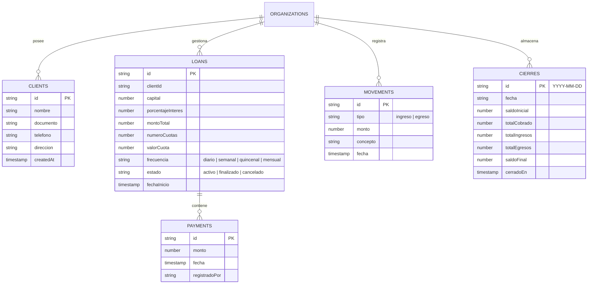

# 🚀 CobraDiarioApp - Sistema Integral de Gestión de Créditos, Cobranza Diaria y Caja

**CobraDiarioApp** es una solución tecnológica avanzada, progresiva (PWA) y multitenant diseñada para optimizar y automatizar la gestión de préstamos, la ruta de cobranza diaria, el cálculo inteligente de mora en tiempo real, el control de caja y la generación de cierres contables con exportación a PDF.

Construido sobre una arquitectura moderna con **React 18**, **Vite**, **Tailwind CSS** (bajo una estética *Flat Design*) y **Firebase Firestore** con soporte completo para sincronización y almacenamiento offline sin conexión a internet.

---

## 📋 Tabla de Contenidos

1. [Visión General y Características Principales](#-visión-general-y-características-principales)
2. [Estructura Completa del Proyecto](#-estructura-completa-del-proyecto)
3. [Guía de Instalación y Configuración](#-guía-de-instalación-y-configuración)
4. [Modelo de Datos en Firebase (Firestore Schema)](#-modelo-de-datos-en-firebase-firestore-schema)
5. [Lógica de Negocio y Algoritmos Financieros](#-lógica-de-negocio-y-algoritmos-financieros)
6. [Gestión de Estado y Hooks en Tiempo Real](#-gestión-de-estado-y-hooks-en-tiempo-real)
7. [Manual de Uso Operativo (Flujos del Sistema)](#-manual-de-uso-operativo-flujos-del-sistema)
8. [Capacidades PWA y Funcionamiento Offline](#-capacidades-pwa-y-funcionamiento-offline)
9. [Paleta de Colores y Sistema de Diseño](#-paleta-de-colores-y-sistema-de-diseño)
10. [Despliegue en Producción (Netlify)](#-despliegue-en-producción-netlify)

---

## 🌟 Visión General y Características Principales

CobraDiarioApp resuelve la necesidad de los cobradores de campo y administradores de crédito de contar con una herramienta rápida, ligera y fiable, capaz de operar tanto con buena conexión como en zonas rurales o de señal deficiente.

### 🔑 Funcionalidades Clave

- **Priorización Inteligente de Ruta ("Ruta del Día")**: Ordena automáticamente a los clientes priorizando en la parte superior a aquellos que presentan cuotas vencidas o mora, optimizando el tiempo del cobrador.
- **Clasificación Dinámica de Estado de Mora**: Algoritmo en tiempo real que determina la salud financiera del cliente (*En Mora*, *Al Día*, *Adelantado*) comparando lo pagado acumulado contra la cuota esperada según la fecha oficial de Colombia (`America/Bogota`) omitiendo domingos o días no hábiles configurados.
- **Sincronización Offline (IndexedDB + Firestore Persistence)**: Permite registrar cobros, préstamos y caja sin conexión a internet. Los datos se guardan localmente en el dispositivo y se sincronizan con la nube al detectar red.
- **Control de Caja y Cierres Diarios**: Monitoreo de ingresos y egresos extraordinarios con cálculo de saldo neto diario y guardado del historial de cierres por fecha.
- **Generación de Reportes PDF**: Exportación limpia de cierres diarios estilo comprobante/factura en formato PDF listo para compartir o imprimir mediante `jsPDF` y `jspdf-autotable`.
- **Instalación PWA (Progressive Web App)**: La aplicación se instala directamente en dispositivos Android, iOS o Windows como una app nativa desde el navegador web.

---

## 📂 Estructura Completa del Proyecto

```text
CobraDiarioApp/
└── cobro-diario-app/
    ├── public/                      # Recursos estáticos e íconos PWA
    │   ├── favicon.ico
    │   ├── icon-192.png
    │   └── icon-512.png
    ├── firebase/                    # Reglas de seguridad de Firestore
    │   └── firestore.rules
    ├── src/
    │   ├── components/              # Componentes de UI modulares y reutilizables
    │   │   ├── forms/               # Formularios interactivos
    │   │   │   ├── ClientForm.jsx   # Formulario de alta y edición de clientes
    │   │   │   └── LoanForm.jsx     # Simulación y otorgamiento de créditos
    │   │   ├── layout/              # Estructura visual de navegación
    │   │   │   ├── BottomNav.jsx    # Barra inferior fija de pestañas
    │   │   │   └── Header.jsx       # Cabecera principal y botón de navegación
    │   │   └── ui/                  # Elementos atómicos de interfaz
    │   │       ├── Badge.jsx        # Etiqueta visual de estado (Mora/Al día/Adelantado)
    │   │       ├── ClientRow.jsx    # Tarjeta de cliente con cambio dinámico de color
    │   │       ├── FrequencySelector.jsx # Selector interactivo de frecuencias
    │   │       └── MetricCard.jsx   # Tarjetas informativas de saldo e indicadores
    │   ├── context/                 # Estado global de React
    │   │   └── AuthContext.jsx      # Autenticación, sesión y orgId de Firebase
    │   ├── firebase/                # Conexión y operaciones de base de datos
    │   │   ├── auth.js              # Iniciar sesión, registro y cerrar sesión
    │   │   ├── config.js            # Inicialización de Firebase con persistencia offline
    │   │   └── firestore.js         # API de servicios CRUD para Firestore
    │   ├── hooks/                   # Custom Hooks para suscripción en tiempo real
    │   │   ├── useClients.js        # Listener en tiempo real para clientes
    │   │   ├── useLoans.js          # Listener en tiempo real para préstamos y pagos
    │   │   └── useMovements.js      # Listener en tiempo real para caja del día
    │   ├── logic/                   # Motor matemático y reglas de negocio
    │   │   ├── caja.js              # Arqueo de caja, balance neto y resumen diario
    │   │   ├── credito.js           # Cálculo de interés, total a pagar y cuotas
    │   │   ├── dateUtils.js         # Manejo estricto de zona horaria Bogotá/Colombia
    │   │   ├── frecuencia.js        # Cálculo de cuotas esperadas según días hábiles
    │   │   ├── mora.js              # Algoritmo de clasificación de estado de mora
    │   │   └── pdfExport.js         # Motor de generación de reportes en PDF
    │   ├── pages/                   # Páginas y vistas principales
    │   │   ├── Caja/                # Registro y vista de movimientos de efectivo
    │   │   ├── Clientes/            # Directorio y búsqueda de clientes
    │   │   ├── Configuracion/       # Parámetros de la organización y tasa global
    │   │   ├── Creditos/            # Otorgamiento de nuevos préstamos
    │   │   ├── Inicio/              # Dashboard principal de métricas y accesos
    │   │   ├── Login/               # Inicio de sesión y registro de cobradores
    │   │   ├── RegistrarCobro/      # Interfaz de registro de abonos individuales
    │   │   ├── Reportes/            # Histórico de cierres y exportación PDF
    │   │   └── RutaDelDia/          # Lista de cobranza diaria con filtro e intelección
    │   ├── styles/                  # Configuración CSS
    │   │   └── index.css            # Estilos globales de Tailwind y Flat Design
    │   ├── App.jsx                  # Enrutador principal (`react-router-dom`)
    │   └── main.jsx                 # Punto de entrada y Bootstrap de React
    ├── .env                         # Variables de entorno locales
    ├── .env.example                 # Guía de variables de entorno requeridas
    ├── .gitignore                   # Exclusión de archivos pesados o confidenciales
    ├── index.html                   # Documento HTML principal
    ├── netlify.toml                 # Reglas de enrutamiento SPA para despliegue en Netlify
    ├── package.json                 # Dependencias y scripts
    ├── postcss.config.js            # Configuración de PostCSS
    ├── tailwind.config.js           # Tema de colores y extensión de estilos
    └── vite.config.js               # Configuración de compilación Vite y PWA
```

---

## 🛠 Guía de Instalación y Configuración

### Requisitos Previos

- **Node.js**: Versión 18.0.0 o superior.
- **npm** o **yarn**: Gestor de paquetes.
- **Proyecto en Firebase**: Cuenta activa en Google Firebase con Firestore Database y Firebase Authentication habilitados (Email/Contraseña).

### Pasos de Instalación

1. **Clonar o descargar el proyecto**:
   ```bash
   git clone <URL_DEL_REPOSITORIO> CobraDiarioApp
   cd CobraDiarioApp/cobro-diario-app
   ```

2. **Instalar dependencias**:
   ```bash
   npm install
   ```

3. **Configurar Variables de Entorno (`.env`)**:
   Crea un archivo `.env` en la raíz de `cobro-diario-app/` utilizando como base `.env.example`:
   ```env
   VITE_FIREBASE_API_KEY=tu_api_key_aqui
   VITE_FIREBASE_AUTH_DOMAIN=tu_proyecto.firebaseapp.com
   VITE_FIREBASE_PROJECT_ID=tu_proyecto_id
   VITE_FIREBASE_STORAGE_BUCKET=tu_proyecto.appspot.com
   VITE_FIREBASE_MESSAGING_SENDER_ID=tu_sender_id
   VITE_FIREBASE_APP_ID=tu_app_id
   ```

4. **Ejecutar en modo Desarrollo**:
   ```bash
   npm run dev
   ```
   La aplicación se abrirá en `http://localhost:5173`.

5. **Compilar para Producción**:
   ```bash
   npm run build
   ```
   Los archivos optimizados para despliegue se generarán en la carpeta `dist/`.

---

## 🔥 Modelo de Datos en Firebase (Firestore Schema)

El sistema utiliza una arquitectura **Multitenant aislada por Organización**, garantizando que cada empresa o cobrador mantenga sus datos 100% segregados e independientes bajo la ruta `/organizations/{orgId}/`.

### Colecciones Principales



### Configuración de Persistencia Offline (`src/firebase/config.js`)

Para asegurar el funcionamiento offline continuo sin desconexiones, la base de datos Firestore se inicializa activando la memoria caché local persistente:

```javascript
import { initializeFirestore, persistentLocalCache, persistentMultipleTabManager } from 'firebase/firestore';

export const db = initializeFirestore(app, {
  localCache: persistentLocalCache({
    tabManager: persistentMultipleTabManager()
  })
});
```

---

## 🧮 Lógica de Negocio y Algoritmos Financieros

Los cálculos matemáticos y financieros están desacoplados de la interfaz gráfica y residen en `src/logic/`:

### 1. Cálculo Financiero del Crédito (`src/logic/credito.js`)

Dado un capital prestado ($C$), un porcentaje de interés ($I$) y un número de cuotas ($N$):

$$\text{Monto Interés} = C \times \left(\frac{I}{100}\right)$$

$$\text{Monto Total a Pagar} = C + \text{Monto Interés}$$

$$\text{Valor por Cuota} = \frac{\text{Monto Total a Pagar}}{N}$$

### 2. Proyección de Fechas y Días Hábiles (`src/logic/frecuencia.js`)

El sistema evalúa las fechas transcurridas desde el inicio del préstamo considerando la frecuencia de cobro (Diaria, Semanal, Quincenal, Mensual) y omitiendo automáticamente los días no laborables (como domingos o días feriados configurados en el sistema).

### 3. Algoritmo de Clasificación de Estado de Mora (`src/logic/mora.js`)

El estado del crédito se clasifica dinámicamente comparando el **Monto Total Abonado** acumulado por el cliente contra el **Monto Esperado a la Fecha**:

- **`mora`** (Roja): El total pagado es **menor** al total esperado a la fecha actual. Se calcula el número exacto de cuotas de atraso y el valor en dinero adeudado.
- **`al_dia`** (Amarilla/Dorada): El total pagado es **igual** al monto esperado a la fecha actual.
- **`adelantado`** (Azul): El total pagado es **mayor** al monto esperado a la fecha actual.

### 4. Control de Caja y Cierres (`src/logic/caja.js`)

Calcula el saldo neto en efectivo del cobrador en tiempo real:

$$\text{Saldo Neto en Caja} = \text{Saldo Inicial} + \sum \text{Cobros de Préstamos} + \sum \text{Ingresos Extra} - \sum \text{Egresos/Gastos}$$

---

## 📱 Manual de Uso Operativo (Flujos del Sistema)

### Flujo 1: Autenticación e Iniciar Sesión
1. Ingrese con su correo electrónico y contraseña.
2. Si es la primera vez, cree una cuenta de cobrador. Al registrarse, el sistema genera automáticamente una Organización única (`orgId`) con la configuración predeterminada.

### Flujo 2: Creación de Clientes y Otorgamiento de Crédito
1. Ingrese al módulo de **Clientes** y presione `+ Nuevo Cliente`.
2. Diligencie el nombre completo, documento, teléfono y dirección del cliente.
3. Presione `Otorgar Préstamo` para abrir el formulario interactivo de crédito (`LoanForm.jsx`).
4. Seleccione el monto deseado, tasa de interés (por defecto 20%), frecuencia y número de cuotas. Observe la vista previa en tiempo real del valor de cuota y total a pagar antes de guardar.

### Flujo 3: Operación en "Ruta del Día"
1. Ingrese a la pestaña **Ruta del Día**.
2. Los clientes aparecerán ordenados inteligentemente: los clientes con **Mora** encabezan la lista destacados en color rojo suave, seguidos por los clientes **Al Día** y **Adelantados**.
3. Use el buscador rápido para filtrar por nombre o dirección.

### Flujo 4: Registrar un Cobro
1. Presione sobre el cliente en la lista para ingresar a **Registrar Cobro**.
2. Visualizará el saldo pendiente, el valor de la cuota sugerida y el historial de abonos.
3. Ingrese la cantidad entregada por el cliente y confirme el cobro. El saldo se actualizará instantáneamente y se registrará en la caja diaria.

### Flujo 5: Gestión de Caja y Cierre Diario
1. Ingrese al módulo de **Caja** para registrar gastos operativos (ejemplo: gasolina, almuerzo) o ingresos extra.
2. En el módulo de **Reportes**, consulte el resumen detallado del día.
3. Presione `Cerrar Caja del Día` para consolidar los números y guardarlos en el historial de la nube.
4. Presione `Descargar Reporte PDF` para generar un comprobante imprimible con los cobros del día, totales y clientes en mora.

---

## 📶 Capacidades PWA y Funcionamiento Offline

CobraDiarioApp está configurada como una **PWA Completa** mediante `vite-plugin-pwa`.

- **Instalación**: Al navegar en la app desde Google Chrome o Safari en un dispositivo móvil, aparecerá la opción "Agregar a la pantalla principal".
- **Modo Offline**: Si el cobrador entra a una zona sin señal de celular:
  - La aplicación continuará cargando normalmente desde el Service Worker.
  - Se podrán registrar abonos y préstamos.
  - Firebase guardará los datos en la base de datos IndexedDB local.
  - Al recuperar la señal de red, Firebase sincronizará automáticamente todas las operaciones pendientes con Firestore sin pérdida de información.

---

## 🎨 Paleta de Colores y Sistema de Diseño

El sistema utiliza un estándar visual **Flat Design (Diseño Plano)** sin sombras pesadas, priorizando la legibilidad en pantallas bajo luz solar directa en campo:

| Función Visual | Color Hexadecimal | Clase Tailwind | Muestra |
| :--- | :--- | :--- | :--- |
| **Color Principal (Brand / Headers)** | `#26215C` | `bg-primary`, `text-primary` | Deep Purple |
| **Acento y Botones Destacados** | `#7F77DD` | `bg-primary-light`, `text-primary-light` | Violet Light |
| **Fondo de Pantalla (Superficie)** | `#EEEDFE` | `bg-primary-bg` | Soft Purple Tint |
| **Estado "Al Día" (Normal)** | `#FAC775` | `bg-[#FAC775]/20`, `text-amber-700` | Warm Gold |
| **Estado "Mora" (Alerta / Prioritario)** | `#EF4444` | `bg-red-50`, `text-red-600` | Crimson Red |
| **Estado "Adelantado" (Informativo)** | `#3B82F6` | `bg-blue-50`, `text-blue-600` | Ocean Blue |

---

## 🌐 Despliegue en Producción (Netlify)

El proyecto incluye el archivo `netlify.toml` con las redirecciones requeridas para aplicaciones de una sola página (SPA):

```toml
[[redirects]]
  from = "/*"
  to = "/index.html"
  status = 200
```

### Pasos para Desplegar en Netlify:

1. Conecte su repositorio de GitHub/GitLab a Netlify.
2. Defina el directorio base del proyecto (`cobro-diario-app`).
3. Comando de construcción (*Build command*): `npm run build`
4. Directorio de publicación (*Publish directory*): `dist`
5. Añada las variables de entorno (`VITE_FIREBASE_*`) en el panel de Netlify (`Site settings > Environment variables`).
6. Presione **Deploy site**.

---

© 2026 **CobraDiarioApp** - Todos los derechos reservados.
